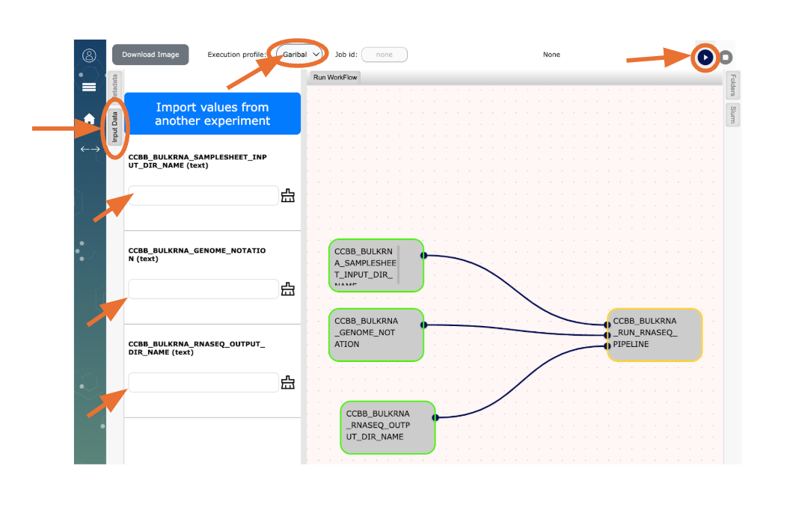

--- 
layout: single
classes: wide
permalink: /pages/CCBB_pipelines/bulk_RNAseq/
title: ""
---

# CCBB Pipelines on Garibaldi -  Bulk RNASeq 
Please follow the instructions below to use our analysis pipeline and run it on your RNASeq data:  

### Step1: 
On Garibaldi, create a folder with your sample fastqs (e.g. 01sample_S1_R1_001.fastq.gz)
- If you have lane-level fastqs for each sample, please concatenate them such that you have one fastq file per sample for single-end dataset and two fastqs per sample for paired-end dataset.
- SampleID should be unique for each sample with no special characters (space, #, _ etc.)
- Sample fastqs need to be gzipped with extension .fastq.gz or fq.gz.
	
### Step2: 
Now you are ready to run the CCBB bulk RNASeq analysis!

Follow the instructions below to begin:

Open [Workflow](http://opaat.scripps.edu/workflow-project) on your browser
(Refer to the image at the end of this document for details)

* Click on “Experiments”
* To select a workflow click on “My WorkFlows” (on the top right corner), then click on “New Experiment”
* Click on  “CCBB_BULKRNASeq_STEP1_WF”
* Choose Garibaldi from the dropdown menu for “Execution profile:” (top of the page)

The first workflow “CCBB_BULKRNASeq_STEP1_WF” is used to create the samplesheet which is needed to run the RNASeq pipeline. This needs two inputs as defined below.\
* Click on the “Input Data” tab and (a) type in the full path to your folder on Garibaldi with sample fastqs (Step4 above), (b) type in the full path to where you want the samplesheet.csv to be generated (this can be same path as for the fastqs), then click the button  to run “CCBB_BULKRNASeq_STEP1_WF”

Upon completion, check to see the samplesheet.csv file on Garibaldi at the location you specified.

Open [Workflow](http://opaat.scripps.edu/workflow-project) on your browser 
* Click on “Experiments”
* To select a workflow click on “My WorkFlows” (on the top right corner), then click on “New Experiment”
* Click on  “CCBB_BULKRNASeq_STEP2_WF”
* Choose Garibaldi from the dropdown menu for “Execution profile:” (top of the page)

The second workflow “CCBB_BULKRNASeq_STEP2_WF” is used to run the RNASeq pipeline. This needs three inputs as defined below.
* Click on the “Input Data” tab and (a) type in the full path to your folder on Garibaldi with samplesheet.csv, (b) type in the reference genome code for your samples (e.g. HU0 (zero not the letter O) for human, MM0 for mouse, RN0 for rat and CE0 for C.elegans), (c ) type in the full path to where you want the results of the bulk RNASeq analysis to be generated on Garibaldi.

#### IMPORTANT NOTE on genomes:
Currently the pipeline will work only for Human, Mouse, Rat and C.elegans. \
If you have any other custom species please contact [CCBB](mailto:ccbb@scripps.edu)

Follow the [details](https://nf-co.re/rnaseq/3.18.0/docs/output/) to understand the pipeline outcome for your data.

### Step3: 
Cleanup
After the successful completion of the RNASeq pipeline, please remove the “work” sub-folder (that holds the intermediate files/folders generated by the pipeline) in your workflow setup folder on Garibaldi. 

### DISCLAIMER:
CCBB is providing pipelines on Garibaldi, the institute’s shared linux cluster, on “as is” and “as available” terms, solely for the benefit of the scientific community at Scripps Research.\
CCBB reserves the right to continue/discontinue any of its pipelines on Garibaldi.

