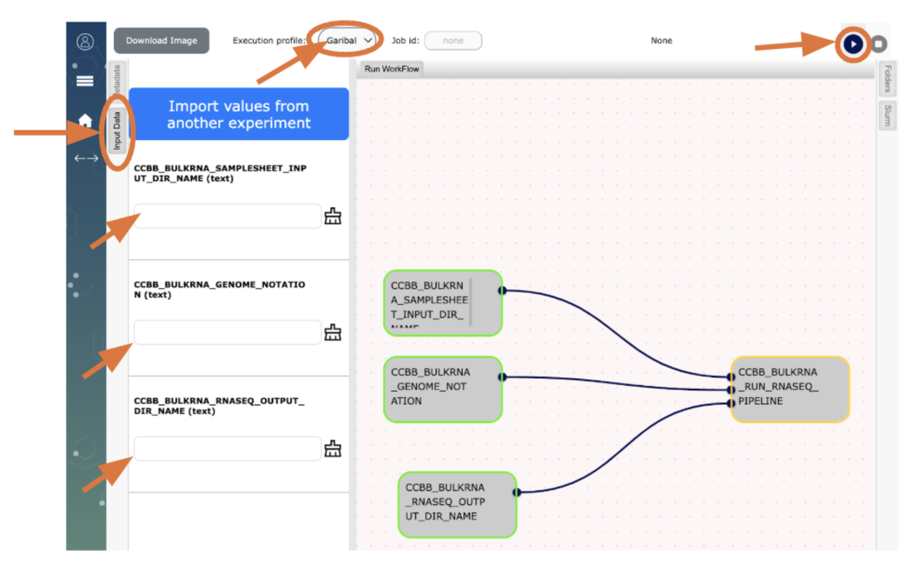

--- 
layout: single
classes: wide
permalink: /pages/CCBB_pipelines/differential_abundance/
title:

---
###  Under development! 

# Differential Abundance 
This nf-core pipeline does differential abundance analysis for feature/ observation matrices from platforms such as RNA-seq.

Please follow the instructions below to use our analysis pipeline and run it on your RNASeq data:  

### Prerequisites: 
CCBB assumes that you have 
* an account on Garibaldi,
* set up [Workflow](http://opaat.scripps.edu/) on your computer,
* completed running our RNAseq pipeline following the usage instructions at  CCBB bulk RNAseq analysis pipeline.  

The outcome for your RNAseq data from [CCBB bulk RNAseq analysis pipeline](https://scrippsccbb.github.io/CCBBwebsite/pages/tutorials/CCBB_BulkRNASeq_Pipeline_Usage/) is required for running the  [CCBB Differential Abundance analysis pipeline](https://scrippsccbb.github.io/CCBBwebsite/pages/tutorials/CCBB_DifferentialAbundanceAnalysis_Pipeline_Usage/).

Please follow the instructions below to get access to our analysis pipeline.

### Step1: 
Preparing input files on Garibaldi for running CCBB differentialabundance pipeline 
	
* Please make sure you have the following files generated by the CCBB bulk RNAseq pipeline, prior to running the differentialabundance pipeline:  
Files “salmon.merged.gene_counts_length_scaled.tsv” and “salmon.merged.gene_lengths.tsv” are available at the location /full-path-to-bulk-RNAseq-folder-on-Garibaldi/results/salmon_star/ 
* In the same folder, generate “DE_samplesheet.csv” and “DE_contrasts.csv” files based on the examples provided [here](https://docs.google.com/spreadsheets/d/157bvnW7UcOJsR3IxaIFKLGzqy4GICBtREwX4voo1i1Q/edit?usp=sharing). 
Edit them to reflect your sample name, /full-path-to-bulk-RNAseq-folder-on-Garibaldi data files (fastqs), group to which the sample belongs (a single word that describes the group), replicate number of the sample (1, 2, 3 …)

### Step2: 
Now you are ready to run the CCBB differentialabundance pipeline!
Follow the instructions below to begin:

Go to the [Workflow site](http://opaat.scripps.edu/workflow-project) on your browser:
(Refer to the image at the end of this document for details)
* Click on “Experiments”
* To select a workflow click on “My WorkFlows” (on the top right corner), then click on “New Experiment”
* Click on  “CCBB_DIFFERENTIALABUNDANCE_WF”
* Choose “Garibaldi” from the dropdown menu for “Execution profile:” (top of the page)

The workflow “CCBB_DIFFERENTIALABUNDANCE_WF” needs the inputs as defined in **Step1** above.
Click on the “Input Data” tab. In the text box, type in the full path to your folder on Garibaldi where you
* (a) performed bulk RNA-seq analysis using our workflow,
* (b) generated the files for your dataset using instructions in **Step1**): “DE_samplesheet.csv” and “contrast.csv”, then click the run button  to run “CCBB_DIFFERENTIALABUNDANCE_WF”.
* (c) type in the full path to where you want the results of the differentialabundance analysis to be generated on Garibaldi.

Upon completion, check to see the sub-folder “DE_results” on Garibaldi at the location you specified. (example: /gpfs/home/johndoe/…/”bulk RNA-seq analysis”/DE_results)

Follow the [details](https://nf-co.re/differentialabundance/1.5.0/docs/output/) to understand the pipeline outcome for your data.

### Step3: Post analysis follow-up for users.
Please follow the instructions that are sent via email upon pipeline completion:

* Contact [CCBB](mailto:ccbb@scripps.edu) for any questions regarding the pipeline, results of analysis, further assistance with downstream analysis (like pathway analysis, custom differential expression analysis, specific plots for publication etc.).
Please take a few minutes to give us your [feedback](https://docs.google.com/forms/d/e/1FAIpQLSflup1jVY7lMb2CUaldWRHJQdGCBwwplTgEE3bZ5ktuq2IoqA/viewform).

### NOTE
If you need custom work to be done (e.g. specific model matrix to be used for a comparison to account for known batch effects) request for a meeting with CCBB. The service hours will be determined by CCBB.	

###  DISCLAIMER 
CCBB is providing pipelines on Garibaldi, the institute’s shared linux cluster, on “as is” and “as available” terms, solely for the benefit of the scientific community at Scripps Research. CCBB reserves the right to continue/discontinue any of its pipelines on Garibaldi.

