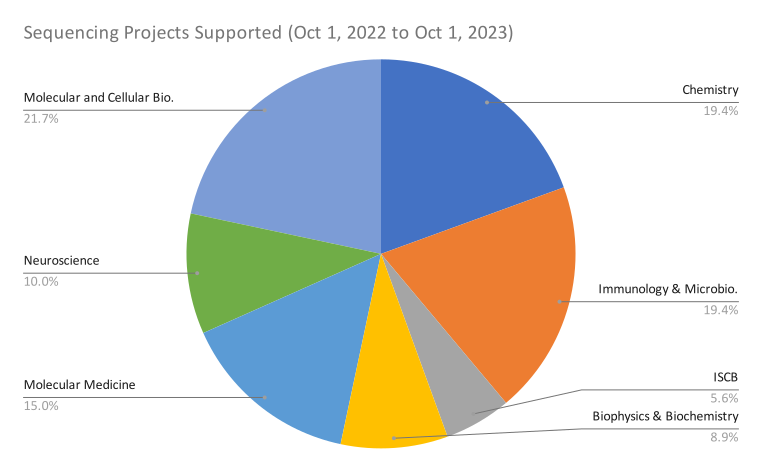

**Center for Computational Biology and Bioinformatics (CCBB)** provides bioinformatic support to the Scripps Research community and several research organizations and biotech companies in analyzing a wide variety of sequencing projects.

## Scientific Advisory Board:

* Ali Torkamani, Professor

* Andrew Su, Professor

* Chunlei Wu, Associate Professor 

* Nathan Wineinger, Associate Professor

## Survey

<iframe src="https://docs.google.com/forms/d/e/1FAIpQLSfVer-oJUCeLRMW3ZMZyKvOUrki2i5cDwdlUQda8qkEyZO-jQ/viewform?embedded=true" width="640" height="3202" frameborder="0" marginheight="0" marginwidth="0">Loading…</iframe>
